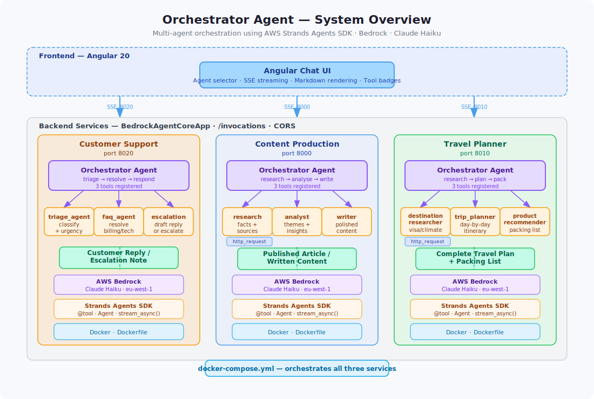

# strands-orchestrator

Multi-agent orchestration demos using the AWS Strands Agents SDK — three domain-specific orchestrators (travel planner, content production, customer support) each coordinating specialist sub-agents via tool calls, with a streaming Angular chat UI.



---

## What is an Orchestrator Agent?

An orchestrator agent is a primary agent that delegates work to specialized sub-agents. Each sub-agent is exposed as a **tool** — the orchestrator reasons about which specialist to call, invokes them, and synthesizes a final response.

```
User Query
    │
    ▼
Orchestrator Agent  ──── system prompt: "delegate to the right specialist"
  ├── specialist_one     tools: [...]
  ├── specialist_two     tools: [...]
  └── specialist_three   tools: []
    │
    ▼
Final Response
```

---

## Project Structure

```
orchestrator-agent/
├── docker-compose.yml                  # runs all services together
├── orchestrator-agent-frontend/        # Angular 20 chat UI
└── orchestrator-agent-backend/
    ├── content_production/             # research → analyse → write
    ├── travel_planner/                 # destination research → itinerary → packing
    └── customer_support/               # triage → resolve → escalate
```

Each backend service is a self-contained Python package with its own orchestrator, specialist agents, Dockerfile, and configuration.

---

## Running with Docker Compose

### Prerequisites

- [Docker](https://docs.docker.com/get-docker/) and Docker Compose
- AWS credentials configured locally (`~/.aws/credentials`) with Bedrock access

### Start all services

```bash
docker compose up --build
```

| Service | URL |
|---|---|
| Angular frontend | http://localhost:4200 |
| Content Production API | http://localhost:8000 |
| Travel Planner API | http://localhost:8010 |
| Customer Support API | http://localhost:8020 |

### Override AWS region or model

```bash
AWS_REGION=us-east-1 MODEL_ID=us.anthropic.claude-haiku-4-5-20251001-v1:0 docker compose up
```

### Run a single service

```bash
docker compose up travel-planner
```

### Stop all services

```bash
docker compose down
```

### View logs

```bash
# All services
docker compose logs -f

# One service
docker compose logs -f travel-planner
```

---

## Running Locally (without Docker)

Each backend service can be run directly:

```bash
cd orchestrator-agent-backend/travel_planner
pip install -e .
cp .env.example .env   # edit if needed
python main.py
```

Frontend:

```bash
cd orchestrator-agent-frontend
npm install
npm start              # http://localhost:4200
```

---

## Core Concepts

An agent in Strands is just three things:

```python
from strands import Agent

agent = Agent(
    model=...,          # any LLM (Bedrock, Anthropic, OpenAI-compatible)
    system_prompt=...,  # agent's role and instructions
    tools=[...]         # functions, MCP servers, or other agents
)
```

Sub-agents become tools via the `@tool` decorator:

```python
from strands import Agent, tool

@tool
def specialist(query: str) -> str:
    """Description the orchestrator uses to decide when to call this."""
    agent = Agent(system_prompt="You are a specialist in X.")
    return str(agent(query))

orchestrator = Agent(
    system_prompt="Delegate to the right specialist.",
    tools=[specialist],
)
```

---

## Multi-Agent Patterns

| Pattern | Control | Best For |
|---------|---------|----------|
| **Orchestrator (Agents-as-Tools)** | High | Hierarchical delegation, clear domain boundaries |
| **Swarm** | Low (emergent) | Creative tasks, diverse perspectives |
| **Graph** | Very High | Strict workflows, regulated pipelines |
| **Workflow (DAG)** | Very High | Known sequential steps with parallel branches |

---

## Key Takeaways

1. **Strands = model-driven**: an agent is just `model + tools + prompt`
2. **Orchestrator pattern** = manager agent whose tools are other agents
3. **Three ways to attach sub-agents**: direct pass, `.as_tool()`, `@tool` decorator
4. **Pick the right pattern**: orchestrator for delegation, graph for strict control, swarm for creative emergence
5. **Start small**: one orchestrator + two specialists, then expand

---

## Resources

- [Strands Agents Docs](https://strandsagents.com/)
- [Agents as Tools Guide](https://strandsagents.com/docs/user-guide/concepts/multi-agent/agents-as-tools/)
- [AWS Blog: Multi-Agent Patterns](https://aws.amazon.com/blogs/machine-learning/multi-agent-collaboration-patterns-with-strands-agents-and-amazon-nova/)
- [Strands 1.0 Announcement](https://aws.amazon.com/blogs/opensource/introducing-strands-agents-1-0-production-ready-multi-agent-orchestration-made-simple/)
- [SDK Python GitHub](https://github.com/strands-agents/sdk-python)
