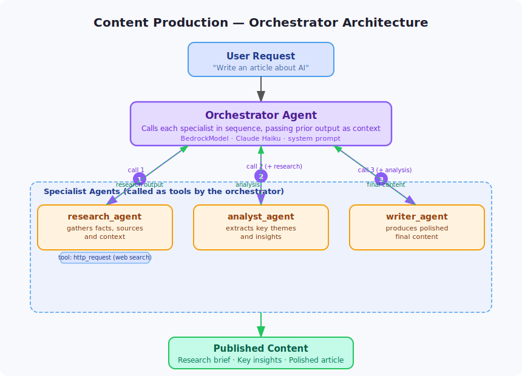

# Content Production Orchestrator

A multi-agent pipeline that produces polished written content by coordinating three specialists: a researcher, an analyst, and a writer.



## How It Works

```
User Query
    │
    ▼
Orchestrator
  ├── research_agent   → gathers facts, sources, and context
  ├── analyst_agent    → extracts key themes and insights from research
  └── writer_agent     → produces polished final content from analysis
```

The orchestrator passes the full output of each step as input to the next, building a complete content piece end-to-end.

## Agents

| Agent | Role | Tools |
|-------|------|-------|
| `research_agent` | Gathers detailed information and sources on the topic | `http_request` |
| `analyst_agent` | Identifies themes, patterns, and key takeaways from the research | — |
| `writer_agent` | Turns analysis into clear, engaging written content | — |

## Setup

```bash
pip install -e .
cp .env.example .env
```

Edit `.env` with your AWS region and model ID if different from the defaults.

## Run

```bash
python main.py
```

## Example Queries

```
"Write an article about how multi-agent AI systems are changing software development"
"Explain the key differences between RAG and fine-tuning for LLM applications"
"Summarise the current state of quantum computing for a non-technical audience"
```

## Configuration

| Variable | Default | Description |
|----------|---------|-------------|
| `AWS_REGION` | `eu-west-1` | AWS region for Bedrock |
| `MODEL_ID` | `eu.anthropic.claude-haiku-4-5-20251001-v1:0` | Bedrock model ID |
| `ORCHESTRATOR_PORT` | `8000` | Port the service listens on |
