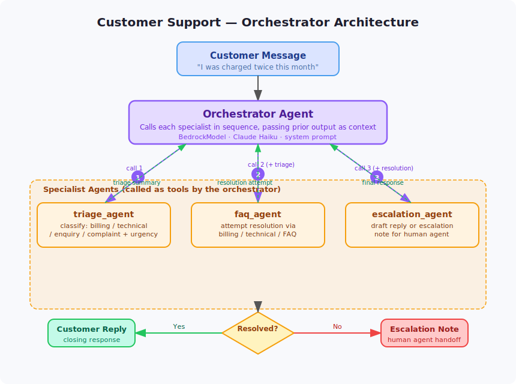

# Customer Support Orchestrator

A multi-agent customer support pipeline that classifies incoming messages, attempts resolution, and produces either a final customer response or an escalation note for a human agent.



## How It Works

```
Customer Message
    │
    ▼
Orchestrator
  ├── triage_agent      → classifies issue type, urgency, and extracts key details
  ├── faq_agent         → attempts resolution using billing/technical/FAQ knowledge
  └── escalation_agent  → drafts final customer reply or human-agent escalation note
```

Every message goes through all three stages. The escalation agent decides — based on resolution outcome — whether to send a closing reply or flag for human follow-up.

## Agents

| Agent | Role | Tools |
|-------|------|-------|
| `triage_agent` | Classifies issue (billing / technical / enquiry / complaint) and assesses urgency | — |
| `faq_agent` | Resolves billing, technical, and general enquiry issues | — |
| `escalation_agent` | Drafts customer response or escalation note with next action | — |

## Setup

```bash
pip install -e .
cp .env.example .env
```

Edit `.env` with your AWS region and model ID if different from the defaults.

## Run

```bash
python main.py
```

## Example Messages

```
"I was charged twice for my subscription this month and I need a refund immediately."
"Hi, I can't log into my account — it says my password is wrong but I just reset it."
"Can you tell me what your cancellation policy is?"
```

## Configuration

| Variable | Default | Description |
|----------|---------|-------------|
| `AWS_REGION` | `eu-west-1` | AWS region for Bedrock |
| `MODEL_ID` | `eu.anthropic.claude-haiku-4-5-20251001-v1:0` | Bedrock model ID |
| `ORCHESTRATOR_PORT` | `8020` | Port the service listens on |
