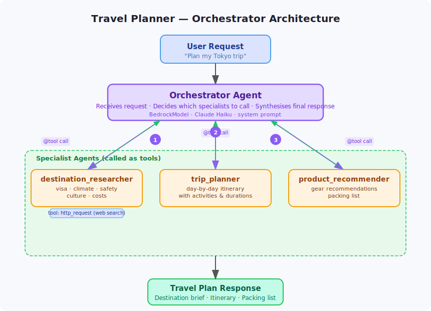

# Travel Planner Orchestrator

A multi-agent travel planning pipeline that coordinates destination research, itinerary building, and gear recommendations into a single cohesive travel plan.



## How It Works

```
User Query
    │
    ▼
Orchestrator
  ├── destination_researcher  → visa, climate, safety, culture, costs
  ├── trip_planner            → day-by-day itinerary with activities
  └── product_recommender     → gear recommendations and packing list
```

## Agents

| Agent | Role | Tools |
|-------|------|-------|
| `destination_researcher` | Practical destination info: visa, climate, safety, culture, costs | `http_request` |
| `trip_planner` | Day-by-day itinerary with activities and estimated durations | — |
| `product_recommender` | Gear recommendations and packing list tailored to the trip | — |

## Setup

```bash
pip install -e .
cp .env.example .env
```

Edit `.env` with your AWS region and model ID if different from the defaults.

## Run

```bash
python main.py
```

## Example Queries

```
"Plan a 10-day trip to Japan in March, focusing on food and photography"
"Weekend city break to Tokyo — what do I need to know and pack?"
"Hiking trip to Patagonia in November for an intermediate hiker"
```

## Configuration

| Variable | Default | Description |
|----------|---------|-------------|
| `AWS_REGION` | `eu-west-1` | AWS region for Bedrock |
| `MODEL_ID` | `eu.anthropic.claude-haiku-4-5-20251001-v1:0` | Bedrock model ID |
| `ORCHESTRATOR_PORT` | `8010` | Port the service listens on |
